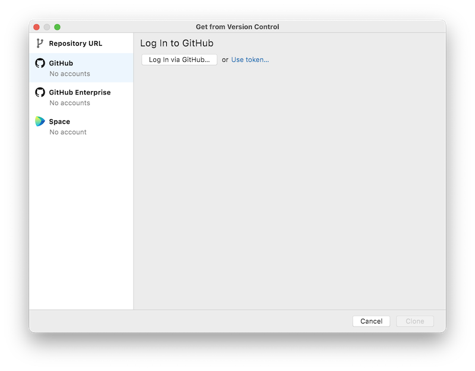
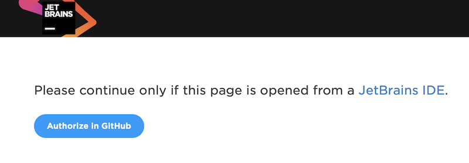

# Базовый эхо-бот с пояснениями для новичков на русском 

## Как начать

### зарегистрироваться на GitHub

1. https://github.com

1. жамкаем кнопку `Sign Up` вверху справа

1. следуем указаниям

### установить PyCharm Community Edition (CE)

1. идем на https://www.jetbrains.com/pycharm/download

1. выбираем свою операционку

1. качаем версию `Community`

1. ставим как обычную программу

### создать бота в @botfather

1. создать бота в @botfather следуя инструкциям (команда `/newbot`)

1. сохранить название бота типа @mybot_bot

1. сохранить себе токен вида:
    ```
    Use this token to access the HTTP API:
    546xxxxxxx:AAHHXXXXXXXXXXXXXXXXXXXXXXYYYYYYYYYY
    ```

1. проверить:
    можно найти в поиске и написать что-то боту по созданному имени. Но отвечать он ничего не будет


### создать новый проект

1. https://github.com/DiPaolo/telegram-bot-template-rus

1. выбрать Use Template и сделать репу себе

### открыть проект в PyCharm

1. запустить `PyCharm`

1. нажать кнопку `Get From VCS`

1. выбираем пункт слева `GitHub`
  

1. нажимаем `Log In via GitHub...`

1. нас перекинет в браузер

1. соглашаемся и нажимаем кнопку
  

1. опять соглашаемся и нажимаем кнопку внизу справа
  

1. возвращаемся в `PyCharm`, выбираем наш только что созданный проект из списка и нажимаем `Clone`

1. проект должен открыться в `PyCharm`; слева будут наши файлы проекта

1. через меню Run->Run... запустить бота
важно сначала сделать этот шаг, хоть бот и не запустится, чтобы в пайчарме вверху справа появилась конфигурация

1. добавить модуль telegram в настройках во вкладке Python Interpreter.
название модуля python-telegram-bot. Версия должна быть 13.xx

1. вставить свой TOKEN

1. запустить бота (вверху справа зеленая кнопка в виде стрелочки типа play)

1. проверить:
- скрипт должен работать
- бот должен отвечать той же фразой, что ты ему пишешь
